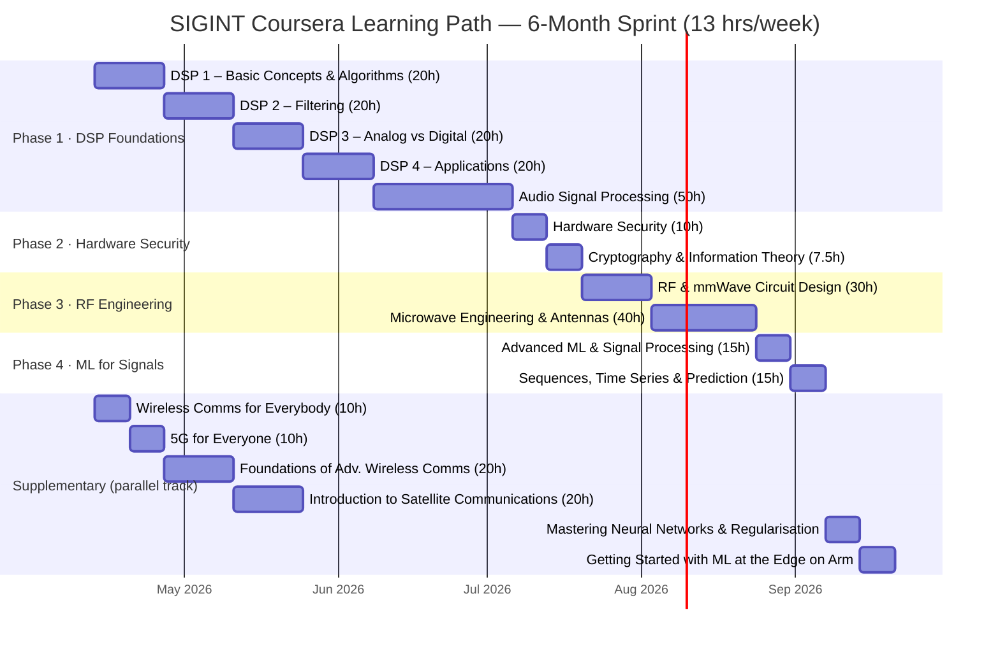

# SIGINT Coursera Learning Path — Gantt Chart

**Wiki navigation:** [Index](em-sca-index.md) · [Academic Overview](electromagnetic-side-channel-analysis.md) · [SIGINT Academic Research](sigint-academic-research-overview.md) · [SIGINT Companies](sigint-private-companies-em-intelligence.md) · [Market Analysis](em-sca-market-analysis-overview.md) · [Key Players](em-sca-key-players-companies.md) · [Entry-Level Setup](entry-level-em-sca-setup.md) (first practical step after Phase 2) · [Practical Guide](electromagnetic-side-channel-practical-guide.md)

> **Pace assumption:** ~13 hrs/week — target completion in 6 months (26 weeks).
> Core path finishes by ~week 21. Supplementary runs as a parallel track, wrapping by week 26.
> **Weekday split suggestion:** 2 hrs/day on weekdays + 3 hrs on Saturday.

---

## Course Reference Table

| # | Course | Phase | Hours | Level | Link |
|---|--------|-------|-------|-------|------|
| 1 | DSP 1 – Basic Concepts & Algorithms | DSP Foundations | 20h | Intermediate | [Open →](https://www.coursera.org/learn/dsp1) |
| 2 | DSP 2 – Filtering | DSP Foundations | 20h | Intermediate | [Open →](https://www.coursera.org/learn/dsp2) |
| 3 | DSP 3 – Analog vs Digital | DSP Foundations | 20h | Intermediate | [Open →](https://www.coursera.org/learn/dsp3) |
| 4 | DSP 4 – Applications | DSP Foundations | 20h | Intermediate | [Open →](https://www.coursera.org/learn/dsp4) |
| 5 | Audio Signal Processing for Music Applications | DSP Foundations | 50h | Intermediate | [Open →](https://www.coursera.org/learn/audio-signal-processing) |
| 6 | Hardware Security | Hardware Security | 10h | Intermediate | [Open →](https://www.coursera.org/learn/hardware-security) |
| 7 | Cryptography and Information Theory | Hardware Security | 7.5h | Intermediate | [Open →](https://www.coursera.org/learn/crypto-info-theory) |
| 8 | RF and mmWave Circuit Design | RF Engineering | 30h | Intermediate | [Open →](https://www.coursera.org/learn/rf-mmwave-circuit-design) |
| 9 | Microwave Engineering and Antennas | RF Engineering | 40h | Advanced | [Open →](https://www.coursera.org/learn/microwave-antenna) |
| 10 | Advanced Machine Learning and Signal Processing | ML for Signals | 15h | Advanced | [Open →](https://www.coursera.org/learn/advanced-machine-learning-signal-processing) |
| 11 | Sequences, Time Series and Prediction | ML for Signals | 15h | Intermediate | [Open →](https://www.coursera.org/learn/tensorflow-sequences-time-series-and-prediction) |
| 12 | Wireless Communications for Everybody | Supplementary | 10h | Beginner | [Open →](https://www.coursera.org/learn/wireless-communications) |
| 13 | 5G for Everyone | Supplementary | 10h | Beginner | [Open →](https://www.coursera.org/learn/5g-training-qualcomm) |
| 14 | Foundations of Advanced Wireless Communication | Supplementary | 20h | Advanced | [Open →](https://www.coursera.org/learn/foundations-of-advanced-wireless-communication) |
| 15 | Introduction to Satellite Communications | Supplementary | 20h | Intermediate | [Open →](https://www.coursera.org/learn/satellite-communications) |
| 16 | Mastering Neural Networks & Model Regularisation | Supplementary | 15h | Intermediate | [Open →](https://www.coursera.org/learn/deep-neural-networks-with-pytorch) |
| 17 | Getting Started with ML at the Edge on Arm | Supplementary | 10h | Intermediate | [Open →](https://www.coursera.org/learn/arm-ml-edge) |

---

## Hour Summary

| Phase | Courses | Total Hours |
|-------|---------|-------------|
| Phase 1 – DSP Foundations | 5 | 130h |
| Phase 2 – Hardware Security | 2 | 17.5h |
| Phase 3 – RF Engineering | 2 | 70h |
| Phase 4 – ML for Signals | 2 | 30h |
| **Core Path Total** | **11** | **~248h** |
| Supplementary | 6 | ~85h |
| **Grand Total** | **17** | **~333h** |
